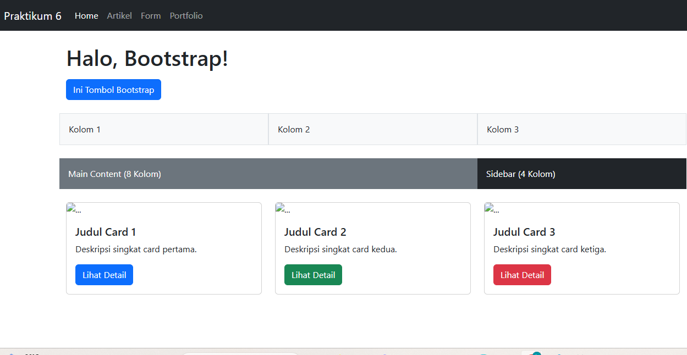
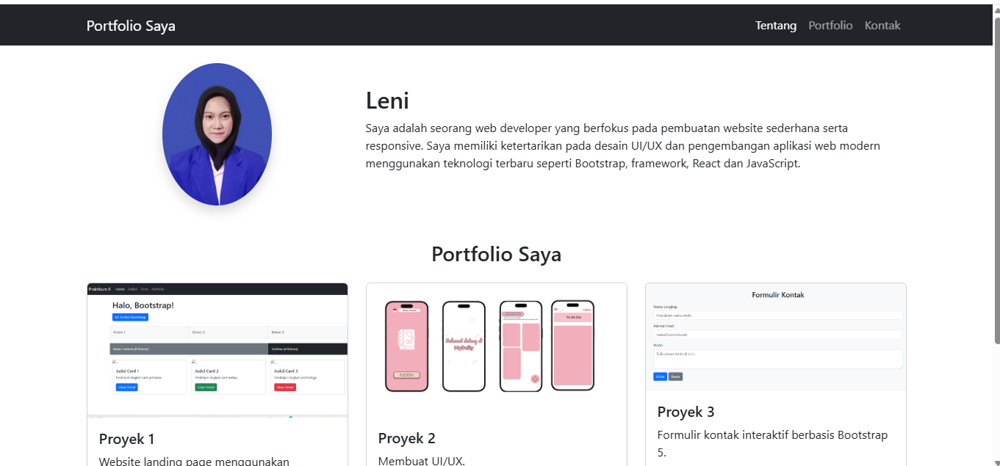

# Praktikum 6: Twitter Bootstrap

 **Nama:** 

 **NIM:** 312410442

 **Kelas:** TI.24.A5

 **Mata Kuliah:** Pemrograman Web


 ## 📂 **Struktur Folder Project**

```
lab6_bootstrap/
├── index.html        → Refactor Layout Praktikum 4
├── form.html         → Refactor Form Praktikum 5
└── portfolio.html    → Tugas Halaman Portfolio Sederhana
```

## 🎯 **Tujuan Praktikum**
1. Memahami konsep **CSS Framework**.
2. Mengetahui fungsi dan penggunaan **Bootstrap 5**.
3. Mengimplementasikan **Grid System** untuk layout responsif.
4. Menggunakan komponen Bootstrap seperti **Navbar**, **Card**, dan **Form**.
5. Membangun layout web sederhana menggunakan Bootstrap.


## ⚙️ **Langkah-Langkah Praktikum**

### 1 Setup Bootstrap
Tambahkan CDN Bootstrap pada file `index.html`:
```html
<link href="https://cdn.jsdelivr.net/npm/bootstrap@5.3.3/dist/css/bootstrap.min.css" rel="stylesheet">
<script src="https://cdn.jsdelivr.net/npm/bootstrap@5.3.3/dist/js/bootstrap.bundle.min.js"></script>

```
### 2 Container dan Grid System

Gunakan `.container` untuk pembungkus konten dan `.row` + `.col` untuk sistem grid 12 kolom.

```html
<div class="container">
  <div class="row">
    <div class="col-4 bg-light p-3 border">Kolom 1</div>
    <div class="col-4 bg-light p-3 border">Kolom 2</div>
    <div class="col-4 bg-light p-3 border">Kolom 3</div>
  </div>
</div>
```


---

### 3️ Komponen: Button

Bootstrap menyediakan berbagai variasi tombol:

```html
<button class="btn btn-primary">Primary</button>
<button class="btn btn-success">Success</button>
<button class="btn btn-danger">Danger</button>
```


---

### 4️ Komponen: Navbar

Menambahkan navigasi responsif:

```html
<nav class="navbar navbar-expand-lg navbar-dark bg-dark">
  <div class="container-fluid">
    <a class="navbar-brand" href="#">Praktikum 6</a>
    <div class="collapse navbar-collapse" id="navbarNav">
      <ul class="navbar-nav">
        <li class="nav-item"><a class="nav-link active" href="index.html">Home</a></li>
        <li class="nav-item"><a class="nav-link" href="form.html">Form</a></li>
        <li class="nav-item"><a class="nav-link" href="portfolio.html">Portfolio</a></li>
      </ul>
    </div>
  </div>
</nav>
```


---

### 5️ Komponen: Card

Card digunakan untuk menampilkan informasi dalam format kotak menarik.

```html
<div class="card" style="width: 18rem;">
  
  <div class="card-body">
    <h5 class="card-title">Judul Card</h5>
    <p class="card-text">Deskripsi singkat card.</p>
    <a href="#" class="btn btn-primary">Lihat Detail</a>
  </div>
</div>
```


---

## 🧱 **Bagian Tugas**

### 🔹 **1. Refactor Layout Praktikum 4**

Buat ulang layout dengan **Bootstrap Grid System**:

* Gunakan `<nav>` untuk navigasi
* `.row` + `.col-md-8` untuk main content
* `.col-md-4` untuk sidebar
* `.card` untuk menggantikan box atau widget lama
* Tidak menggunakan `float` atau `clear`

📁 File: `index.html`

### 📸 Capture
 

---

### 🔹 **2. Refactor Form Praktikum 5**

Gunakan class Bootstrap `.form-control`, `.form-label`, dan `.btn` untuk membuat tampilan form lebih rapi dan konsisten.

📁 File: `form.html`

### 📸 Capture


---

### 🔹 **3. Tugas Akhir – Halaman Portfolio Sederhana**

Buat halaman **`portfolio.html`** yang berisi:

* Navbar di atas halaman
* Section “Tentang Saya” dengan 2 kolom:

  * Kiri: foto (`.img-fluid`)
  * Kanan: nama dan deskripsi
* Section “Portfolio Saya” dengan 3 card proyek (`.col-md-4` masing-masing)
* Footer di bagian bawah

📁 File: `portfolio.html`

### 📸 Capture


---


